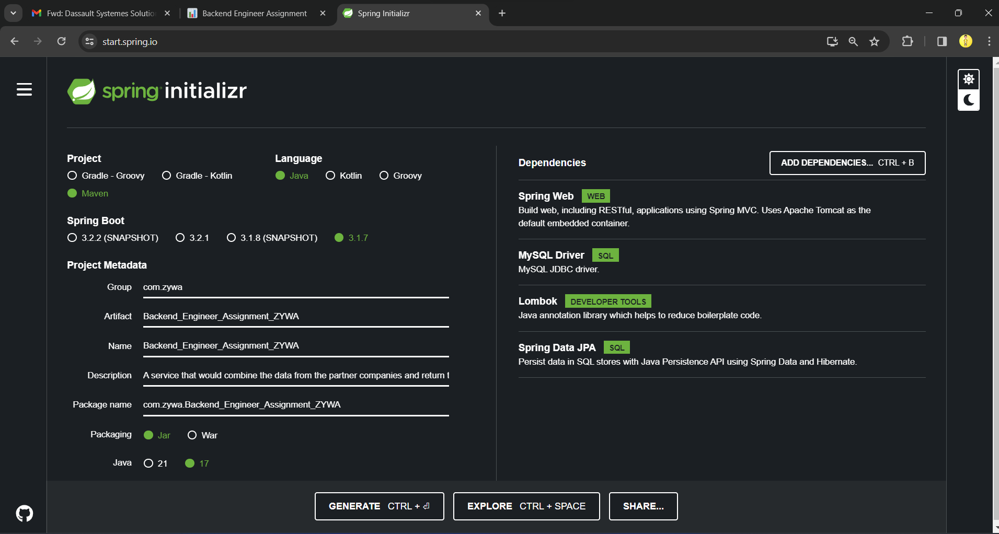

# Backend_Engineer_Assignment_ZYWA

Assignment can be found here only
https://zywa.notion.site/zywa/Backend-Engineer-Assignment-26f201a34bb84af4be9537b95bb85c36#37e0fac8cdfd4f32abc5ba996384ed26

## Problem

As a backend Engineer at Zywa you are tasked in providing an internal API that would return the status of a user’s card.

We need a service that would combine the data from our partner companies and return the current status of a card when queried for by a team mate.

## Specifics

Internally, let’s say we identify a user with their phone number, and for this particular task, let us ignore the country code, and set it to be a 9 digit number. A user’s card has a unique identifier as well, and for this task, we can assume that all entities involved uses the same ID to refer to the card.

Here’s a top level flow of what happens to a card

- Card is generated by us
- Card is picked up by courier partner
- Card is delivered
- If the Card could not be delivered, re-delivery is attempted maximum of two times
- If all attempts of delivery fail, it is returned to us

## Internal API

The data shared by the above companies are in separate CSV files, and as such, all the info about a user’s card is not readily available. To help support agents, and for internal tracking, we need to create an endpoint `/get_card_status` that takes in the user’s phone number or the card ID, and returns the card’s status.

- Database must be implemented, it must not be in-memory
- Assume a folder that contains all the CSV of information related to the card exists under `data`
- You are free to design the endpoint payload for both the request and the response as seen fit
- We can use any language or framework for the server to implement the `get_card_status` endpoint

## Bonus

- Create a `Dockerfile` for deploying the service

# 💡 Submission

---

- Submit the code as a zip file. It must contain all relevant code, and a ReadMe file outlining the approach, why a particular framework/language was used, possible improvements, or any other architectural decisions that were made.

---

## Project Guidelines

- Yet to be written!!!!!!!!!!!!!!!!!!!!!!!!
